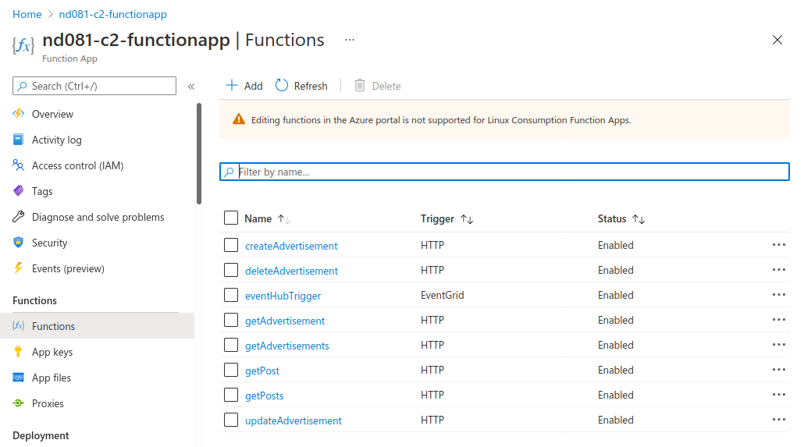
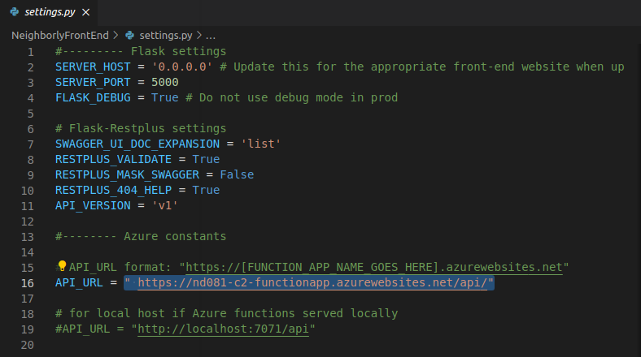
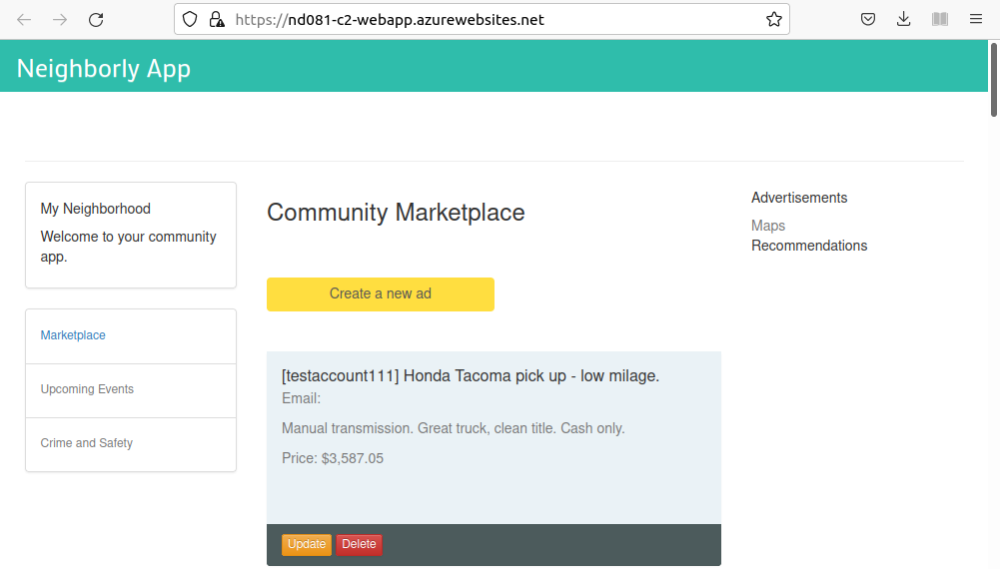

### Serverless Functions

1. A MongoDB database in Azure CosmosDB service is created and initialized with the sample data provided.

    

    

2. The finished server-side application contains working Azure Functions for HTTP Triggers in Python.

    
    

3. The Azure Functions HTTP Trigger endpoints can connect to MongoDB in Azure CosmosDB service.

    

4. The client-side application in Flask should be able to call the live Functions API endpoints that the students published in previous steps.

    

    


### Logic Apps and Event Hubs

1. The student demonstrates mastery in using Azure Logic App Designer to create a trigger.

    

    

2. The student should be able to create a custom event grid topic and publish the topic.


    

3. The student should be able to add the connection string of the event hub to the Azure Function.

    - Create and copy `Shared Access Policy` connection string

        

    - Add `EventHubConnectionString` into function app appsetting

        

    - In `eventHubTrigger`'s `function.json` setting

        ```json
        {
        "scriptFile": "__init__.py",
        "bindings": [
            {
            "type": "eventHubTrigger",
            "name": "event",
            "direction": "in",
            "eventHubName": "hub1", 
            "connection": "EventHubConnectionString"
            }
        ]
        }
        ```

### Deploying Your Application

1. The student should be able to deploy their Neighborly web application on Azure App Service.

    

    

2. The student should be able to containerize their Flask application with Dockerfile.

    

3. The code demonstrates an automated pipeline to spin Kubernetes services in Azure.

    

    